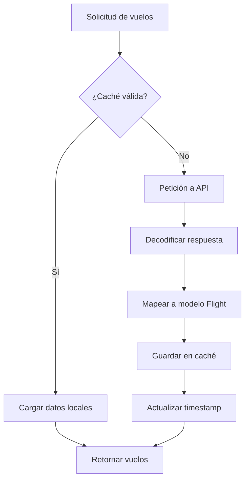

# GCRadar - Documentación Técnica

> **GCRadar** es una aplicación iOS desarrollada en **SwiftUI** que permite visualizar información de vuelos en tiempo real del aeropuerto de Gran Canaria (LPA), incluyendo llegadas, salidas, espacio aéreo, detalles de vuelo, mapas interactivos y gestión de favoritos.

---

## 📁 Arquitectura del Proyecto

El proyecto sigue el patrón **MVVM (Model-View-ViewModel)**:

```
GCRadar/
├── Models/           # Modelos de datos
├── ViewModels/       # Lógica de negocio y estado
├── Views/            # Interfaces de usuario
│   ├── Auth/         # Vistas de autenticación
│   ├── Components/   # Componentes reutilizables
│   ├── Detail/       # Detalle de vuelo y mapa
│   ├── Home/         # Vistas principales
│   └── Tabs/         # Navegación por pestañas
├── Services/         # Servicios de red y APIs
└── Helpers/          # Funciones auxiliares
```

---

## 🔐 Autenticación con Firebase

### Configuración

Firebase se inicializa en `GCRadarApp.swift`:

```swift
import FirebaseCore

@main
struct GCRadarApp: App {
    init() {
        FirebaseApp.configure()
    }
}
```

### AuthViewModel

El `AuthViewModel` gestiona todo el flujo de autenticación mediante el SDK de Firebase Auth:

| Método | Descripción |
|--------|-------------|
| `register(email:password:confirmPassword:)` | Registra un nuevo usuario |
| `login(email:password:)` | Inicia sesión con credenciales |
| `logout()` | Cierra la sesión actual |

**Características:**
- **Listener de estado**: Detecta automáticamente cambios en la autenticación
- **Validaciones locales**: Email válido, contraseña ≥6 caracteres, confirmación coincidente
- **Estados reactivos**: `isAuthenticated`, `isLoading`, `errorMessage`, `currentUser`

```swift
// Listener que actualiza automáticamente el estado
authStateHandle = Auth.auth().addStateDidChangeListener { _, user in
    self.currentUser = user
    self.isAuthenticated = user != nil
}
```

### Control de Errores de Autenticación

El enum `AuthError` mapea errores de Firebase a mensajes legibles en español:

| Error | Mensaje |
|-------|---------|
| `invalidEmail` | El email no es válido |
| `passwordTooShort` | La contraseña debe tener al menos 6 caracteres |
| `passwordsDoNotMatch` | Las contraseñas no coinciden |
| `weakPassword` | La contraseña es demasiado débil |
| `emailAlreadyInUse` | Este email ya está registrado |
| `userNotFound` | Usuario no encontrado |
| `wrongPassword` | Contraseña incorrecta |
| `networkError` | Error de conexión. Verifica tu internet |

---

## ⭐ Favoritos con Firestore

### Estructura en Firestore

```
users/
└── {userId}/
    └── favorites/
        └── {flightNumber}/
            ├── flightNumber: String
            ├── airline: String (opcional)
            └── createdAt: Timestamp
```

### FavoritesViewModel

Gestiona los vuelos favoritos del usuario autenticado:

| Método | Descripción |
|--------|-------------|
| `addFavoriteFlightNumber(_:airline:)` | Añade un vuelo a favoritos |
| `removeFavoriteFlightNumber(_:)` | Elimina un vuelo de favoritos |
| `loadFavoriteFlightNumbers()` | Carga todos los favoritos del usuario |
| `isFavoriteFlight(_:)` | Verifica si un vuelo está marcado |
| `toggleFavorite(_:airline:)` | Alterna el estado de favorito |

**Características:**
- **Sincronización automática**: Escucha cambios de autenticación para cargar/limpiar favoritos
- **Almacenamiento eficiente**: Usa un `Set<String>` en memoria para consultas O(1)
- **Sin duplicados**: El ID del documento es el propio número de vuelo

---

## ✈️ Conexión a la API de Vuelos (AviationStack)

### Configuración

```swift
private let apiKey = "YOUR_API_KEY"
private let baseUrl = "https://api.aviationstack.com/v1/flights"
```

### Endpoints Utilizados

| Tipo | Parámetro | Descripción |
|------|-----------|-------------|
| Llegadas | `arr_iata=LPA` | Vuelos que llegan a Gran Canaria |
| Salidas | `dep_iata=LPA` | Vuelos que salen de Gran Canaria |

### Flujo de Consulta



### AviationService

```swift
class AviationService {
    func fetchArrivalsToLPA() async throws -> [Flight]
    func fetchDeparturesFromLPA() async throws -> [Flight]
}
```

El servicio incluye:
- **Gestión automática de caché** (ver sección Cache)
- **Mapeo de modelos**: Transforma `ApiFlightData` → `Flight`
- **Manejo de valores nulos**: Proporciona valores por defecto

---

## 📦 Modelo de Datos: Flight

### Estructura Principal

```swift
struct Flight: Identifiable, Codable {
    let id: UUID
    let departureTime: String        // ISO 8601
    let arrivalTime: String          // ISO 8601
    let departureDelay: Int?         // Minutos de retraso
    let arrivalDelay: Int?
    let identifiers: FlightIdentifiers
    let origin: AirportInfo
    let destination: AirportInfo
    let live: LiveInfo
    let airline: AirlineInfo
    let aircraft: AircraftInfo
    let isLive: Bool                 // Si hay datos en tiempo real
}
```

### Subestructuras

| Estructura | Campos |
|------------|--------|
| `AirportInfo` | `airport`, `iata`, `gate?`, `terminal?` |
| `FlightIdentifiers` | `iata`, `icao` |
| `LiveInfo` | `latitude`, `longitude`, `altitude`, `speed` |
| `AircraftInfo` | `model`, `registration` |
| `AirlineInfo` | `name`, `iata` |

### Propiedades Computadas

```swift
extension Flight {
    var duration: TimeInterval?        // Duración en segundos
    var durationString: String         // Ej: "3h 15m"
    var departureTimeFormatted: String // Ej: "14:30"
    var arrivalTimeFormatted: String   // Ej: "17:45"
    var departureDate: Date?           // Objeto Date para ordenación
    var arrivalDate: Date?
    
    func timeOnly(from isoString: String) -> String  // Extrae hora de ISO
}
```

---

## 💾 Gestión de Caché

### Estrategia

El sistema implementa una **caché basada en archivos** con expiración de **24 horas**:

```swift
enum FlightType: String {
    case arrivals = "arr_iata"
    case departures = "dep_iata"
    
    var cacheKey: String { "last_api_check_lpa_\(self.rawValue)" }
    var fileName: String { "cached_flights_lpa_\(self.rawValue).json" }
}
```

### Almacenamiento

| Dato | Ubicación | Formato |
|------|-----------|---------|
| Vuelos | `Documents/cached_flights_lpa_*.json` | JSON codificado |
| Timestamp | `UserDefaults` | `Date` |

### Flujo de Caché

```swift
private func shouldRefreshData(for type: FlightType) -> Bool {
    guard let lastCheck = UserDefaults.standard.object(forKey: type.cacheKey) as? Date else {
        return true  // No hay caché, refrescar
    }
    return Date().timeIntervalSince(lastCheck) > (24 * 60 * 60)  // 24 horas
}
```

### Beneficios

- ✅ Reduce consumo de créditos de API
- ✅ Mejora tiempos de carga
- ✅ Funciona offline con datos guardados
- ✅ Actualización automática tras 24h

---

## 🖼️ APIs de Imágenes

### Logo.dev - Logotipos de Aerolíneas

Muestra el logotipo de una aerolínea basándose en su nombre:

```swift
let LOGO_DEV_PUBLIC_KEY = "pk_..."

struct CompanyLogo: View {
    let name: String
    
    var body: some View {
        AsyncImage(url: URL(string: "https://img.logo.dev/\(name)?token=\(LOGO_DEV_PUBLIC_KEY)"))
    }
}
```

**Helper de Dominio** (`AirlineDomain.swift`):

Convierte el nombre de la aerolínea a un dominio válido:

```swift
func domain(for airline: String) -> String {
    var name = airline.lowercased()
    name = name.folding(options: .diacriticInsensitive, locale: .current)
    name = name.components(separatedBy: CharacterSet.alphanumerics.inverted).joined()
    return "\(name).com"
}
// "Iberia Airlines" → "iberiaairlines.com"
```

### SerpAPI - Imágenes de Aviones

Busca imágenes del modelo de avión mediante Google Images:

```swift
class SerpApiViewModel: ObservableObject {
    @Published var images: [SerpImage] = []
    
    func searchImages(query: String) {
        // URL: https://serpapi.com/search.json?engine=google_images_light&q={query}
    }
}
```

**Modelo de Respuesta:**

```swift
struct SerpImage: Codable, Identifiable {
    let position: Int?
    let thumbnail: String?
    let title: String?
    let original: String?   // URL de imagen completa
}
```

---

## 🗺️ Google Maps

### Configuración

Se inicializa en `GCRadarApp.swift`:

```swift
import GoogleMaps

init() {
    GMSServices.provideAPIKey("YOUR_GOOGLE_MAPS_API_KEY")
}
```

### FlightMapView

Componente que envuelve `GMSMapView` para SwiftUI mediante `UIViewRepresentable`:

```swift
struct FlightMapView: UIViewRepresentable {
    let latitude: Double
    let longitude: Double
    
    func makeUIView(context: Context) -> GMSMapView {
        let camera = GMSCameraPosition.camera(
            withLatitude: latitude,
            longitude: longitude,
            zoom: 6.0
        )
        let mapView = GMSMapView.map(withFrame: .zero, camera: camera)
        addMarker(on: mapView)
        return mapView
    }
}
```

**Características:**
- Zoom y scroll habilitados
- Marcador azul en la posición del vuelo
- Snippet con coordenadas exactas
- Actualización dinámica de cámara

---

## 🎠 Carrusel de Imágenes

### ImageCarouselView

Componente que muestra imágenes del modelo de avión en formato carrusel:

```swift
struct ImageCarouselView: View {
    @StateObject private var viewModel = SerpApiViewModel()
    var query: String  // Ej: "Boeing 737"
    
    var body: some View {
        TabView {
            ForEach(viewModel.images) { item in
                AsyncImage(url: URL(string: item.original ?? item.thumbnail ?? ""))
            }
        }
        .tabViewStyle(.page)  // Estilo de paginación
        .frame(height: 320)
    }
}
```

**Características:**
- Paginación horizontal nativa con `TabViewStyle.page`
- Carga asíncrona de imágenes con `AsyncImage`
- Estados de carga, error y vacío
- Esquinas redondeadas y padding

---

## ⚠️ Control de Errores

### Niveles de Manejo

| Capa | Implementación |
|------|----------------|
| **Autenticación** | `AuthError` enum con mensajes localizados |
| **Red** | Propagación de errores con `throws` |
| **ViewModels** | `@Published var errorMessage: String?` |
| **UI** | Alertas y textos condicionales |

### Patrón Común en ViewModels

```swift
@Published var isLoading = false
@Published var errorMessage: String?

func performAction() async {
    isLoading = true
    errorMessage = nil
    
    do {
        // Acción
        isLoading = false
    } catch {
        errorMessage = "Error: \(error.localizedDescription)"
        isLoading = false
    }
}
```

### Validaciones de Usuario

```swift
// Validación de email
private func isValidEmail(_ email: String) -> Bool {
    let emailRegex = "[A-Z0-9a-z._%+-]+@[A-Za-z0-9.-]+\\.[A-Za-z]{2,64}"
    let emailPredicate = NSPredicate(format: "SELF MATCHES %@", emailRegex)
    return emailPredicate.evaluate(with: email)
}
```

---

## 📚 Librerías Utilizadas

| Librería | Uso | Instalación |
|----------|-----|-------------|
| **Firebase/Auth** | Autenticación de usuarios | Swift Package Manager |
| **Firebase/Firestore** | Base de datos para favoritos | Swift Package Manager |
| **GoogleMaps** | Mapa con posición del vuelo | CocoaPods / SPM |
| **SwiftUI** | Framework de UI declarativo | Nativo iOS 14+ |

### Dependencias Externas (APIs)

| Servicio | Propósito | Límite |
|----------|-----------|--------|
| **AviationStack** | Datos de vuelos en tiempo real | Según plan |
| **SerpAPI** | Búsqueda de imágenes de Google | Según plan |
| **Logo.dev** | CDN de logotipos de empresas | Gratuito con límites |

---

## 🚀 Configuración Inicial

### 1. Firebase

1. Crear proyecto en [Firebase Console](https://console.firebase.google.com)
2. Añadir app iOS con Bundle ID del proyecto
3. Descargar `GoogleService-Info.plist` y añadirlo al proyecto
4. Habilitar Authentication → Email/Password
5. Crear base Firestore

### 2. Google Maps

1. Crear proyecto en [Google Cloud Console](https://console.cloud.google.com)
2. Habilitar Maps SDK for iOS
3. Crear API Key y añadirla en `GCRadarApp.swift`

### 3. APIs Externas

Obtener API keys de:
- [AviationStack](https://aviationstack.com)
- [SerpAPI](https://serpapi.com)
- [Logo.dev](https://logo.dev)

---

## 📱 Vistas Principales

| Vista | Descripción |
|-------|-------------|
| `AuthRootView` | Selector Login/Registro |
| `LoginView` | Formulario de inicio de sesión |
| `RegisterView` | Formulario de registro |
| `ArrivalsView` | Lista de vuelos que llegan |
| `DeparturesView` | Lista de vuelos que salen |
| `FavouritesView` | Vuelos marcados como favoritos |
| `FlightDetailView` | Detalle completo de un vuelo |
| `FlightMapView` | Mapa con posición del avión |
| `ProfileView` | Información del usuario |

---

## 📄 Licencia

Este proyecto ha sido desarrollado con fines educativos.
